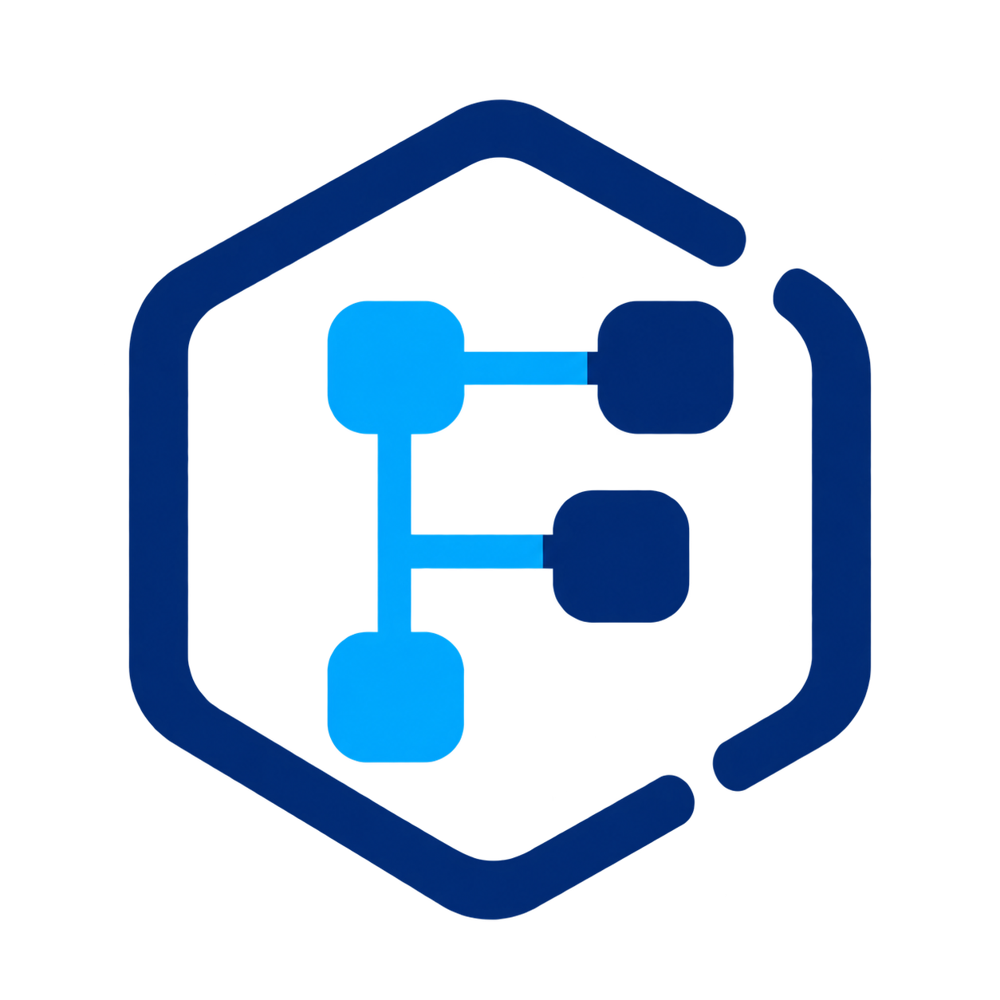
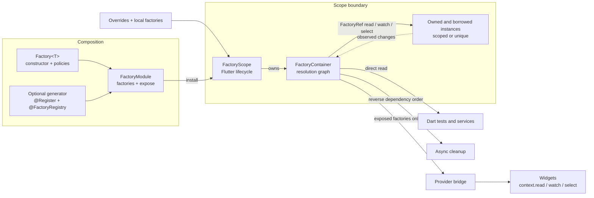
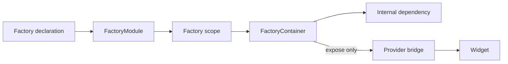

<p align="center">
  
</p>

# Factory

[](https://github.com/argote-dev/factory/actions/workflows/verify.yml)

Dependency injection for Flutter apps that already use Provider. Declare how
objects are built, install a module, and keep using `context.read`,
`context.watch`, `context.select`, and `Consumer`.

Factory is an initial implementation under development. The optional generator
collects declarations; it does not annotate your business classes or infer their
constructors.

## Architecture at a glance



Declarations describe construction and lifecycle without creating values.
Modules install those declarations into a scope; overrides and local factories
can replace or reconnect parts of the graph. The container resolves lazily,
tracks dependencies and ownership, reacts to explicit observations, and cleans
up dependents before dependencies. In Flutter, only declarations listed in
`expose` cross the Provider bridge, so existing widgets keep using the standard
Provider APIs while Factory retains lifecycle ownership.

## Manual setup

```dart
import 'package:factory/factory.dart';
import 'package:flutter/material.dart' hide Factory;

final client = Factory<ApiClient>(
  (_) => ApiClient(),
  dispose: (value) => value.close(),
);
final repository = Factory<UserRepository>(
  (ref) => UserRepository(ref.read(client)),
);
final appModule = FactoryModule(
  factories: [client, repository],
  expose: [repository],
);

// Around the existing application:
FactoryScope(modules: [appModule], child: const MyApp());
```

Only `expose` entries become Provider values. Every declaration belongs to the
scope where it is installed; registration order does not matter. Separate
`Factory<T>` objects can represent different dependencies with the same type.
Exposing two different declarations of the same type in one scope is an error.

## Lazy creation and lifetimes

The default is lazy creation and `Lifetime.scoped`: one value per owning scope.
`lazy: false` creates the value when that scope opens. `Lifetime.unique` creates
a value for every container resolution. Provider caches its exposed value, so
reading it through a widget does not repeatedly resolve a unique declaration.
Construction is synchronous; initialize asynchronous services outside Factory
and supply their ready instances.

## Existing dependencies and nested flows

```dart
final session = Factory<Session>.external();

// Under an existing Provider<Session>; install session in appModule too.
FactoryScope(
  modules: [appModule],
  overrides: [session.overrideWithValue(context.watch<Session>())],
  child: const MyApp(),
);

// A nested flow with a local replacement and explicitly local dependent:
FactoryScope(
  modules: [profileModule],
  overrides: [client.overrideWithValue(previewClient)],
  local: [repository],
  child: const ProfilePage(),
);
```

Borrowed values are never disposed by Factory. `overrideWith` replaces a
constructor and accepts its own `dispose` callback for an owned value. A child
inherits the parent's instances unless declarations are installed locally.
`local` reconnects selected dependents without changing the parent's graph.
Expose local values through a local module when widgets need to consume them.

## Explicit observation

- `ref.read(factory)` connects without subscribing.
- `ref.watch(factory)` also observes instance replacement.
- `ref.select(factory, selector)` also observes selected state changes. Flutter
  supplies `Listenable` support; pure Dart containers accept an `observe` adapter.

A declaration using observation must choose a response:

```dart
final account = Factory<AccountRepository>(
  (ref) => AccountRepository(ref.select(session, (value) => value.userId)),
  onChange: ChangePolicy.recreate,
  dispose: (value) => value.close(),
);

final controller = Factory<ProfileController>(
  (ref) => ProfileController(ref.watch(repository)),
  onChange: ChangePolicy.update,
  update: (ref, value) => value.setRepository(ref.watch(repository)),
  dispose: (value) => value.dispose(),
);
```

`update` mutates the existing instance and must re-declare its observations.
A failed recreation is reported by subsequent resolution; Factory does not
serve the old value as a fallback. A later observed change can retry the graph.
An in-place update cannot promise rollback of mutations. Use pure constructors,
selectors and updates; they must not change the graph while it is being resolved.

Declared `ChangeNotifier` types automatically forward their notifications to
Provider. Register their `dispose` callback explicitly; Provider does not own
these objects. Declaring a notifier merely as `Object` does not opt into this
adapter.

## Cleanup and tests without widgets

```dart
final container = FactoryContainer(
  modules: [appModule],
  overrides: [client.overrideWithValue(fakeClient)],
);
try {
  final value = container.read(repository);
  // Exercise the real wiring.
} finally {
  await container.close();
}
```

Closing rejects new resolutions immediately, closes children first and releases
dependents before dependencies. Every cleanup is attempted. Failures are reported
as `FactoryCleanupException`; repeated `close()` calls return the same future.
A failed eager initialization throws `FactoryInitializationException` with the
original error and an awaitable `cleanup` future.

Owned unique values with cleanup and replaced scoped generations remain alive
until their scope closes, because previously returned references may still be in
use. Direct unique resolutions without cleanup or observation are not retained. Use short
scopes for short-lived resources. `FactoryScope.onClose` exposes the close future;
`onError` handles cleanup failures (the default reports through FlutterError).
Unmounting starts cleanup without waiting. For an explicitly awaited close, use
`FactoryScope.of(context).close()` before leaving a flow. Dispose callbacks should
not resolve more dependencies or await the scope's own closing future.

## Optional annotations

Flutter applications add only `factory` at runtime and add `factory_generator`
plus `build_runner` as development dependencies. Standalone Dart applications
use `factory_core` instead.

```dart
// lib/composition/factories.dart
@Register(module: 'app')
final client = Factory<ApiClient>((_) => ApiClient());

@Register(module: 'app', expose: true)
final repository = Factory<UserRepository>((ref) => UserRepository(ref.read(client)));

// lib/composition/registry.dart
@FactoryRegistry(
  include: ['lib/composition/**.dart'],
  runtime: FactoryRuntime.flutter,
)
void configureFactories() {}
```

Run `dart run build_runner watch`. Import `composition/registry.factory.dart`
and install its `appModule`. Generated modules include internal/eager declarations
as well as the exposed subset. The manual equivalent remains available.

## Integration and Provider exposure



A declaration enters a module and is installed in a Factory scope. The
container can resolve every installed declaration for composition, but only the
module's `expose` subset crosses the Provider bridge to widgets. Module and
scope are different concepts. Start with the
[executable quick start](example/README.md) and the
[public API guide](docs/api-guide.md). Review this diagram whenever module
exposure or the Flutter bridge changes.

## Repository development

This repository contains the Flutter adapter at the root, a standalone Dart core
in `packages/factory_core`, and the optional `packages/factory_generator`. Local
`dependency_overrides` connect the packages before publication.

```sh
flutter pub get
(cd packages/factory_core && dart pub get && dart test && dart analyze)
(cd packages/factory_generator && dart pub get && dart test && dart analyze)
flutter test
flutter analyze lib test
(cd example && dart run build_runner build && flutter test && flutter analyze)
./tool/verify_consumers.sh
```

See [the runnable example](example/README.md) for both Factory and Provider-only
entrypoints using the same business classes and widgets, and
[compatibility and validation](docs/support.md) for tested SDKs and platforms.

Contributions are welcome. Read [the contribution guide](CONTRIBUTING.md) before
opening a pull request. Please report vulnerabilities according to the
[security policy](SECURITY.md), not through a public issue.

Factory is available under the [MIT License](LICENSE).
